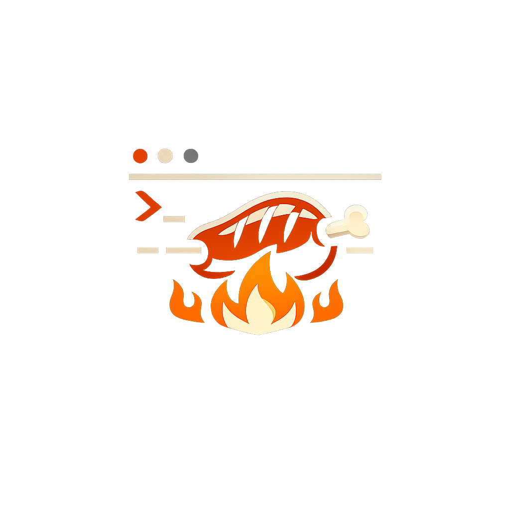

# ArrOSt

<p align="center">
  <br/>
  <strong>ArrOSt</strong><br/>
  <em>A Rust OS, slow-roasted.</em>
</p>

ArrOSt is an educational 64-bit operating system written in Rust (`no_std`) and developed for QEMU-first bring-up.
The current targets are `x86_64-unknown-none` and `aarch64-unknown-none`, with a UEFI boot path on both architectures.
The project favors observable behavior, serial-first diagnostics, reproducible smoke coverage, and incremental subsystem work over broad platform support.

## What ArrOSt includes today

- UEFI boot on `x86_64` and `aarch64`, with serial diagnostics always available.
- Windowed framebuffer desktop UI with taskbar, terminal windows, file manager, and Doom viewport.
- QEMU/virtio-first device stack for block, net, input, and audio.
- Hybrid process model: cooperative kernel tasks, ring-3 ELF processes, and scheduler-visible external runtime helpers.
- Ring-3 ELF isolation with per-process page-table ownership, dedicated user virtual mappings, and kernel-resume fault containment.
- KPTI trampoline infrastructure with per-CPU scratch state and architecture-specific CR3/TTBR0 switching on syscall/fault entry/exit paths.
- Timer-driven hard preemption via PIT IRQ0 (x86_64) / GIC virtual timer IRQ27 (aarch64) with 10-tick quantum.
- Mount-aware inode-based VFS with persistent `diskfs-v2`, `ramfs` fallback, `procfs`, and `tmpfs`.
- Full-data journaling: `MetadataOnly`, `Ordered` (default), and `Full` modes with on-disk persistence and runtime shell control.
- `fork` + CoW + demand paging: `SYS_FORK` clones ring-3 processes with CoW-shared address spaces; write faults trigger per-page copy; anonymous VMAs via `mmap`/`brk` are demand-paged on first access.
- Syscall ABI revision `5` with 52+ syscalls, including filesystem syscalls, per-process fd tables, BSD TCP socket syscalls, extended POSIX-like directory and process-identity ops, pipe IPC, `fork`, `mmap` (anonymous), and `brk`.
- VFS-backed `/bin/*` command dispatch: shell and GUI terminal auto-execute ring-3 ELF binaries from the mounted filesystem.
- Extended `/proc` with global system files, per-PID directories, and `/proc/net/` subsystem.
- TCP/IP networking with state machine (SYN_SENT through LAST_ACK), BSD socket syscalls, and kernel-side Unix network utilities.
- Cross-target build orchestration and smoke automation through `cargo xtask`.
- DoomGeneric integration with runtime controls, viewport rendering, virtio-audio preference, and OPL2 FM music synthesiser using GENMIDI patches (M31D).

## Repository layout

- `kernel/`: `no_std` kernel crate with architecture code, memory, interrupts, drivers, process model, filesystem, shell, graphics, and network stack.
- `crates/arrostd/`: shared ABI, syscall numbers, constants, and userland shim helpers.
- `user/init/`: embedded ring-3 init app metadata and artifact.
- `user/doom/`: embedded ring-3 Doom app metadata, Doom bridge code, and DoomGeneric integration sources.
- `xtask/`: build orchestration, image generation, ABI checks, and QEMU smoke harnesses.
- `scripts/`: QEMU launch scripts and helper scripts such as DoomGeneric vendoring.
- `docs/`: subsystem documentation for boot, memory, interrupts, process model, syscalls, storage, filesystem, networking, graphics, userland, and Doom.

## Current implementation snapshot

### Boot and platform

- `x86_64` boots through a UEFI disk image produced by `xtask`.
- `aarch64` boots on QEMU `virt` through an AAVMF/UEFI chainloader path with staged ESP payloads.
- `aarch64` runtime uses virtio-mmio discovery, while shared drivers keep a legacy-style register model where needed.
- Serial diagnostics remain the baseline debugging path even when framebuffer UI is active.

### Memory and isolation

- KPTI trampoline infrastructure: ring-3 transitions route through architecture trampoline entry/exit paths with per-CPU KPTI scratch (kernel/user root tables, kernel/user RSP).
- x86_64: provisional CR3 switches in `trampoline_syscall_entry` / `trampoline_page_fault_entry`.
- aarch64: TTBR0 switch+barrier sequencing in sync trampoline dispatch, with `SP_EL0` / kernel SP capture/restore.
- Timer-driven hard preemption: PIT IRQ0 (x86_64) and GIC virtual timer IRQ27 (aarch64) preempt ring-3 at any instruction boundary. Quantum = 10 ticks (`RING3_PREEMPT_QUANTUM`).

### Filesystem

- Root filesystem mounts `diskfs-v2` when persistent storage is ready, otherwise falls back to `ramfs`.
- Synthetic mounts:
  - `/proc` -> read-only `procfs` (dynamic per-PID dirs, `net/`, `cpuinfo`, `meminfo`, `version`)
  - `/tmp` -> volatile `tmpfs` with world-writable root (`0777`)
- `diskfs-v2` provides:
  - inode-based hierarchical directories
  - automatic migration from `diskfs-v1`
  - fixed inode table plus block bitmap allocator
  - redo-only metadata journal with replay on mount
  - journal modes: `MetadataOnly`, `Ordered` (default), and `Full` data journaling
- Path resolution is mount-aware and supports `.` / `..`, hard links, symlinks, and `ELOOP` after 8 symlink hops.
- File metadata tracks `uid`, `gid`, `mode`, `nlink`, `atime`, `mtime`, and `ctime`.
- Permission enforcement is active in the VFS.
- Per-process fd tables support `open`, `close`, `fread`, `fwrite`, `seek`, `fstat`, `dup`, and `dup2`.
- Pipe IPC: 8-slot global table, 4 KiB circular buffers, ref-counted read/write ends. Shell `cmd1 | cmd2` pipeline syntax (up to 4 stages).
- Repeated path walks use a dentry cache with conservative invalidation on namespace mutations.
- Shell and GUI terminal commands auto-dispatch to `/bin/<cmd>` when that path exists and carries execute permission.
- Default user home is `/home/user`, and shell history persists in `/home/user/.history`.
- `Tab` completion works for `/bin` commands and for relative/absolute file paths in the current working directory.

Representative commands:

- `pwd`, `cd <dir>`, `ls [-als] [<path>]`
- `cat <file>`, `echo <text> > <file>`
- `mkdir <dir>`, `mv <src> <dst>`
- `link <src> <dst>`, `symlink <target> <linkpath>`
- `stat <path>`, `chmod <mode> <path>`
- `sync`, `reload`, `journal`, `journal mode <metadata|ordered|full>`
- `cat /proc/self/pid`, `cat /proc/mounts`, `cat /proc/uptime`

### Processes and syscalls

- Cooperative kernel task table for core runtime tasks.
- Ring-3 multiprocess runtime for VFS-backed `/bin/*` ELFs plus embedded `ring3 run` smoke/debug apps (`init`, `doom`).
- Additional external process table for compositor-launched terminals and Doom runtime sessions.
- Ring-3 scheduling is round-robin with timer-driven hard preemption (10-tick quantum via PIT IRQ0 on x86_64 / GIC virtual timer IRQ27 on aarch64) and syscall-timeslice preemption.
- Ring-3 ELF segments and stacks are mapped into dedicated per-arch user virtual ranges owned by each process (`0x0000_2000_...` on `x86_64`, `0x0000_0004_...` on `aarch64`).
- Kernel/user copies for ring-3 syscalls are translated through the owning process page tables instead of dereferencing user pointers directly.
- `x86_64` ring-3 entry uses `int 0x80` with DPL3 gate and TSS `RSP0`; aarch64 uses EL0 `SVC`.
- KPTI (M11): ring-3 page tables preserve only upper-half kernel mappings; each process maps a dedicated trampoline page; syscall/fault/sync transitions route through per-architecture trampoline entry/exit paths with per-CPU scratch root/RSP tracking.
- `fork` (M13, complete): `SYS_FORK` clones the active ring-3 process with CoW-shared address space; write faults copy pages on demand; anonymous VMAs (`mmap`/`brk`) are demand-paged.
- User-mode CPU faults transition the active ring-3 task to `faulted` and resume the kernel instead of taking down the whole system.
- Capability masks gate syscall families (`CORE`, `NET`, `PROC`, `TIME`).
- ABI revision is `5`. Shell prompt is context-aware and starts in `/home/user`: `user@arrost /path> ` in both serial and GUI terminals.

Current syscall surface (52 syscalls):

- lifecycle: `exit`, `yield`, `sleep`, `getpid`, `time_ms`, `spawn`, `waitpid`, `fork`
- capabilities: `cap_get`, `cap_drop`
- networking: `socket`, `sendto`, `recvfrom`, `bind`, `listen`, `accept`, `connect`, `send`, `recv`
- filesystem: `open`, `close`, `fread`, `fwrite`, `seek`, `fstat`, `dup`, `dup2`
- directory/path: `mkdir`, `rmdir`, `unlink`, `rename`, `link`, `symlink`, `readlink`, `getcwd`, `chdir`, `getdents`
- process identity: `getppid`, `getuid`, `getgid`, `kill`
- ipc: `pipe`, `pipe2`
- stubs (return `ENOSYS`): `sigaction`, `sigreturn`

Useful runtime commands:

- `user apps`
- `ring3`
- `ring3 smoke`
- `ring3 groundwork`
- `ring3 run <init|doom>`
- `ring3 ps`
- `ring3 wait <pid|any|all>`
- `ps`
- `kill <pid|self>`
- `waitx <pid|any|all>`
- `syscalls`

### UI, networking, and Doom

- Desktop compositor with taskbar and `Apps` launcher.
- Multi-window GUI terminal sessions with independent state.
- File manager backed by the current VFS API.
- Virtio network path with ARP, IPv4, ICMP ping, UDP send/receive, TCP state machine with BSD socket syscalls (including passive `bind`/`listen`/`accept`), congestion control (slow start, Reno CWND), TIME_WAIT timer, and `curl` support for UDP and HTTP.
- Unix network utilities available as `/bin/*` executables and shell commands: `netstat`, `ifconfig`, `route`, `arp`, `ss`, `nc`, `ip`, `ping`, `traceroute`, `host`, `dig`.
- DoomGeneric runtime with dedicated window, keyboard capture, configurable viewport filter, and audio status/control commands.

## Known limitations

- File-backed `mmap` and `MAP_SHARED` are not yet implemented (return `ENOSYS`).
- Signal infrastructure (M20) is implemented for ring-3 processes: `sigaction`/`sigreturn`, `pending_signals` bitmask, POSIX default actions, fork inheritance. Cooperative tasks still return `ENOSYS`. Signal masking (`sigprocmask`) is deferred.
- No `/dev` filesystem or device nodes.
- ANSI/VT100 CSI escape sequences (M25) are parsed and rendered in the GUI terminal with per-cell 16-color output. Serial pass-through and bold/underline rendering are deferred.
- Environment variables (M26): per-process env arrays with `SYS_GETENV`/`SYS_SETENV`/`SYS_UNSETENV`; shell `env`/`export`/`$VAR` expansion. `envp` passed to `execve` is deferred.
- Single-core only; no SMP support.
- No real-time clock or wall-clock timestamps.
- No block/buffer cache; all disk I/O is synchronous and uncached.
- `procfs` does not yet expose `/proc/<pid>/fd/`, `/proc/diskstats`, or `/proc/interrupts`.
- `diskfs-v2` journaling is transaction-size limited by fixed journal capacity (63 staged sectors per transaction).
- TCP retransmission queue (RTO, Karn's algorithm) is not implemented; packet delivery in QEMU's slirp is reliable so this is not observable.
- Device abstraction (M18 HAL) provides trait wrappers and a device registry; existing subsystem consumers still call virtio driver globals directly rather than going through `&dyn BlockDevice` / `&dyn NetDevice`.

## Milestone roadmap

See `docs/MILESTONES.md` for detailed implementation plans. Summary:

| # | Milestone | Status |
|---|-----------|--------|
| M11 | KPTI | Complete |
| M12 | VFS-backed ELF launch | Complete |
| M13 | fork + CoW + demand paging | Complete |
| M14 | Timer-driven hard preemption | Complete |
| M15 | Extended syscall surface | Complete |
| M16 | Extended ProcFS | Complete |
| M17 | Full-data journaling | Complete |
| M18 | Hardware abstraction layer | Complete |
| M19 | Production TCP/IP + utilities | Complete |
| M20 | Signal infrastructure | Complete |
| M21 | Full mmap / VMA layer | Complete |
| M22 | execve syscall | Complete |
| M23 | /dev filesystem | Planned |
| M24 | Shell pipes + process groups | Complete |
| M25 | ANSI terminal emulation | Complete |
| M26 | Environment variables | Complete |
| M27 | SMP / multi-core | Planned |
| M28 | RTC + wall-clock time | Planned |
| M29 | Block cache | Planned |
| M30 | Multi-user + login | Planned |
| M31 | Doom enhancements | Planned |
| M31D | Doom authentic music (OPL2) | Complete |

## Build

### Prerequisites

- Rust nightly with:
  - `rust-src`
  - `llvm-tools-preview`
  - `rustfmt`
  - `clippy`
- `qemu-system-x86_64`
- `qemu-system-aarch64`
- UEFI firmware files:
  - OVMF/edk2 for `x86_64`
  - AAVMF/edk2 for `aarch64`
- C compiler toolchain (`cc` or clang-compatible) for Doom bridge objects

### Build artifacts

```bash
cargo xtask build
```

This produces:

- kernel and user artifacts for `x86_64-unknown-none` and `aarch64-unknown-none`
- UEFI boot image at `target/x86_64-unknown-none/debug/bootimage-arrost-kernel.bin`
- shared storage image at `target/x86_64-unknown-none/debug/m6-disk.img`
- `aarch64` kernel ELF at `target/aarch64-unknown-none/debug/arrost-kernel`
- `aarch64` UEFI loader at `target/aarch64-unknown-uefi/debug/arrost-aarch64-uefi-loader.efi`
- staged `aarch64` ESP payload at `target/aarch64-unknown-none/debug/efi/`

Show `xtask` usage:

```bash
cargo xtask --help
```

## Run

### Interactive QEMU

Default (`x86_64`):

```bash
cargo xtask run
```

`aarch64`:

```bash
cargo xtask run --arch aarch64
```

or:

```bash
ARROST_ARCH=aarch64 cargo xtask run
```

Useful environment overrides:

- `QEMU_DISPLAY=none|cocoa|gtk|sdl`
- `QEMU_ACCEL=auto|none|hvf|kvm|whpx|tcg`
- `QEMU_CPU=auto|host|qemu64|...`
- `QEMU_SMP=auto|<cores>`
- `QEMU_AUDIO=auto|none|coreaudio|wav`
- `QEMU_AUDIO_WAV_PATH=/tmp/arrost.wav`
- `QEMU_FB=auto|ramfb|bochs|none`
- `QEMU_INPUT=virtio|ps2`
- `QEMU_VIRTIO_SND=on|off`
- `QEMU_VIRTIO_BUS=mmio|auto`
- `QEMU_GIC_VERSION=2|3|max`
- `OVMF_CODE=/path/to/OVMF_CODE.fd`
- `OVMF_VARS=/path/to/OVMF_VARS.fd`
- `AAVMF_CODE=/path/to/AAVMF_CODE.fd`
- `AAVMF_VARS=/path/to/AAVMF_VARS.fd`
- `ARROST_RING3_BOOT_SMOKE=true|false`
- `ARROST_RING3_BOOT_SMOKE_FAULT=true|false` (`aarch64` only)
- `ARROST_RING3_ELF_GROUNDWORK=true|false` (`true` by default for `xtask build/run`; set to `false` only to force the old pre-M12 path)

Notes:

- On `aarch64`, virtio runs through virtio-mmio; `pci` aliases are forced back to `mmio`.
- `QEMU_FB=auto` prefers firmware framebuffer handoff (`ramfb`) when available.
- `ARROST_DISABLE_DENTRY_CACHE=1` is a build-time switch that disables the dentry cache in the compiled kernel.

### Doom prerequisites

Vendor DoomGeneric sources:

```bash
scripts/vendor_doomgeneric.sh
```

Place the WAD at:

```text
user/doom/wad/doom1.wad
```

## Validation

### Formatting and lint

```bash
cargo fmt --all
cargo clippy -p xtask --all-targets -- -D warnings
cargo clippy -p arrost-kernel --target x86_64-unknown-none -Zbuild-std=core,compiler_builtins,alloc -Zbuild-std-features=compiler-builtins-mem -- -D warnings
cargo clippy -p arrost-kernel --target aarch64-unknown-none -Zbuild-std=core,compiler_builtins,alloc -Zbuild-std-features=compiler-builtins-mem -- -D warnings
```

### ABI and unit checks

```bash
cargo xtask abi-check
cargo xtask abi-check --arch x86_64
cargo xtask abi-check --arch aarch64
cargo test -p xtask
cargo test -p arrost-user-init
cargo test -p arrost-user-doom
```

### QEMU smoke suites

Representative smoke commands:

- `cargo xtask smoke-doom --arch x86_64`
- `cargo xtask smoke-doom --arch aarch64`
- `cargo xtask smoke-doom-long --arch x86_64`
- `cargo xtask smoke-doom-long --arch aarch64`
- `cargo xtask smoke-doom-virtio --arch aarch64`
- `cargo xtask smoke-doom-fallback --arch x86_64`
- `cargo xtask smoke-doom-fallback --arch aarch64`
- `cargo xtask smoke-proc-caps --arch x86_64`
- `cargo xtask smoke-proc-caps --arch aarch64`
- `cargo xtask smoke-proc-spawn --arch x86_64`
- `cargo xtask smoke-proc-spawn --arch aarch64`
- `cargo xtask smoke-bin-exec --arch x86_64`
- `cargo xtask smoke-bin-exec --arch aarch64`
- `cargo xtask smoke-fork --arch x86_64`
- `cargo xtask smoke-fork --arch aarch64`
- `cargo xtask smoke-kpti-m11`
- `cargo xtask smoke-fs --arch x86_64`
- `cargo xtask smoke-fs --arch aarch64`
- `cargo xtask smoke-ring3 --arch x86_64`
- `cargo xtask smoke-ring3 --arch aarch64`
- `cargo xtask smoke-ring3-run --arch x86_64`
- `cargo xtask smoke-ring3-run --arch aarch64`
- `cargo xtask smoke-ring3-fault --arch aarch64`
- `cargo xtask smoke-net --arch x86_64`
- `cargo xtask smoke-net --arch aarch64`
- `cargo xtask smoke-kpti-m11 --arch x86_64`
- `cargo xtask smoke-kpti-m11 --arch aarch64`

## Documentation index

- `docs/BOOT.md`
- `docs/MEMORY.md`
- `docs/INTERRUPTS.md`
- `docs/PROC.md`
- `docs/SYSCALLS.md`
- `docs/STORAGE.md`
- `docs/FS.md`
- `docs/NET.md`
- `docs/GFX.md`
- `docs/USERLAND.md`
- `docs/DOOM.md`
- `docs/MILESTONES.md`

## License

Apache-2.0.
